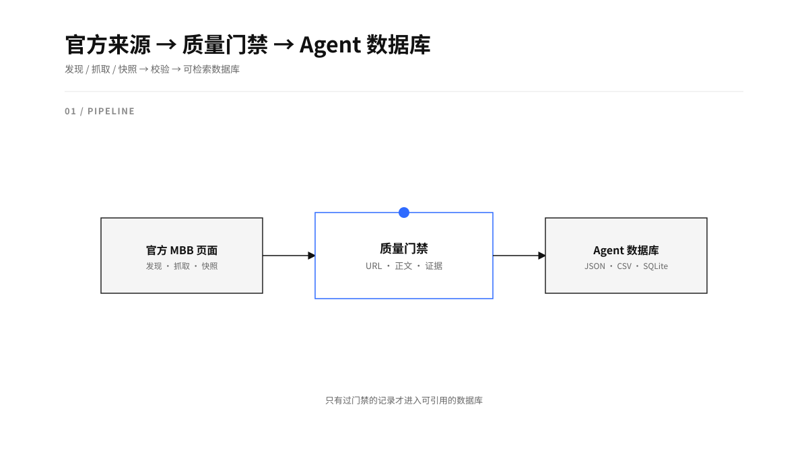
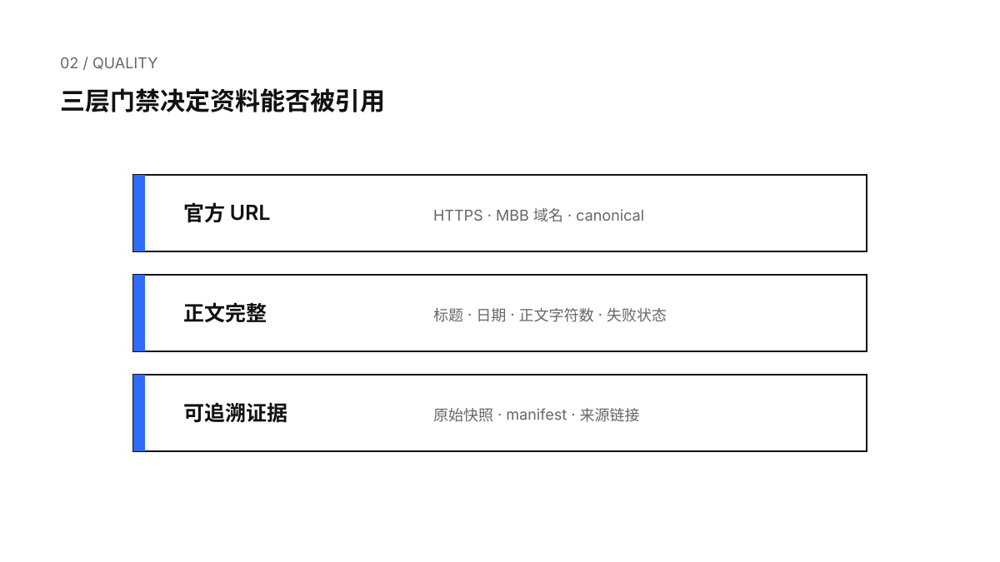
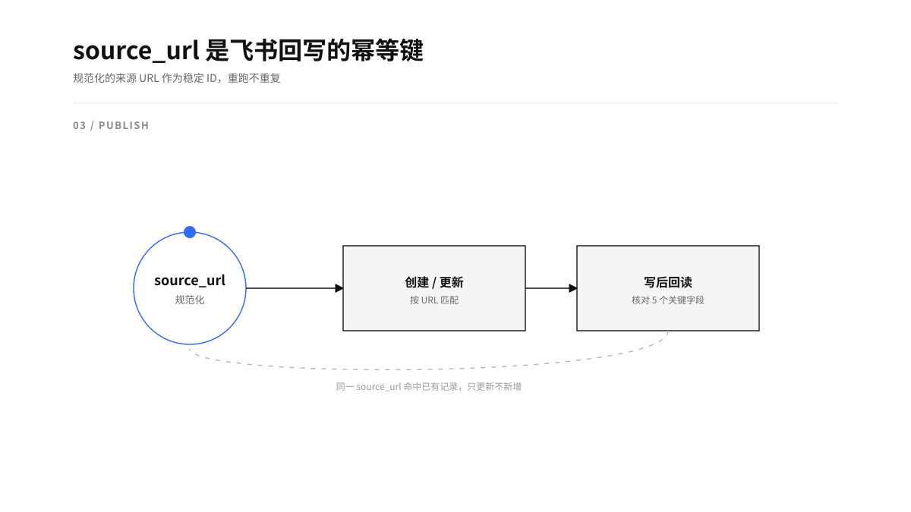
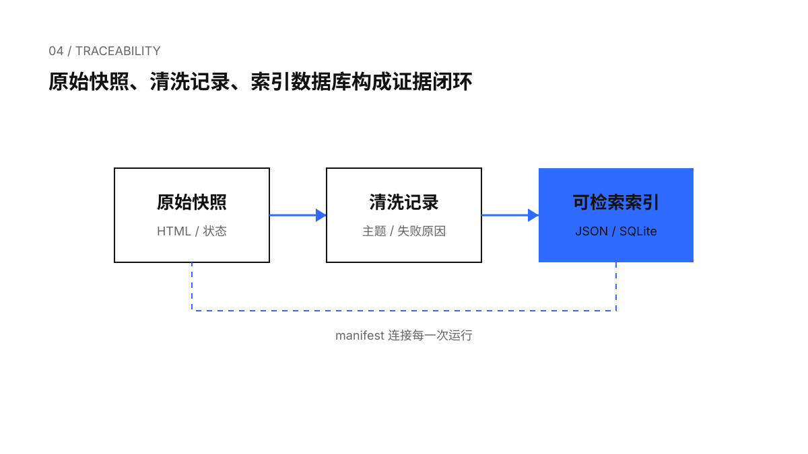

# 麦肯锡人力大脑

*200W token 挖来的 MBB 人力顾问，10 年工作经验，关注人才、组织、AI 转型。*

这是一套可复跑的 Codex Skill：从 McKinsey、BCG、Bain 官方网站发现人才管理相关内容，完成正文抽取和质量门禁，再构建带来源、状态、主题和全文索引的 Agent 数据库。飞书回写作为独立发布适配器，支持幂等写入和写后回读。

<p align="center"></p>

## 解决什么问题

长期运行的人力研究，核心风险集中在来源混杂、正文缺失、重复抓取、内容不可追溯和回写重复。Skill 将官方来源采集、数据库构建、飞书发布拆开，每一步都留下可检查的运行产物。

<p align="center"></p>

## 快速开始

将本目录放进 Codex 的 skills 目录，或在已加载本 Skill 的任务中直接调用：

```text
$mckinsey-people-brain
```

采集阶段由项目内的 MBB 站点适配器负责，统一生成 `targets.json`、`fetched.json`、`raw/` 和 `collect-manifest.json`。本仓库提供通用的质量校验和数据库构建脚本：

```bash
python3 scripts/validate_records.py data/runs/20260806-01/fetched.json --min-body-chars 800 --strict
python3 scripts/build_agent_db.py \
  --run-dir data/runs/20260806-01 \
  --base-corpus data/agent-db/records.json \
  --min-body-chars 800
```

构建结果位于 `agent-db/`：`records.json`、`source-register.csv`、`agent-db.sqlite`、`manifest.json`。采集器可以替换，记录契约和下游格式保持稳定。

## 设计原则

- 只把 MBB 官方域名作为最终来源；搜索结果和转载页只能作为发现线索。
- `source_url` 经过规范化后作为稳定 ID 和幂等键。
- `ok`、`restricted`、`no_body`、`error` 代表不同证据状态，受限内容不能用猜测补齐。
- 原始快照、清洗记录和数据库通过 `run_id`、manifest、source URL 连接。
- 本地数据库是事实来源，飞书发布必须经过用户身份确认、dry-run 和写后回读。

<p align="center"></p>

## 内容主题

默认主题包括人才战略与组织设计、AI 与未来工作、技能与学习、绩效与激励、People Analytics、员工体验与文化、领导力与管理、劳动力规划与招聘。主题用于检索和聚合，引用仍需回到原始来源 URL。

<p align="center"></p>

## 目录

```text
SKILL.md                         Skill 工作流与边界
config.example.json              脱敏后的来源配置示例
references/data-contract.md      记录与状态契约
references/source-adapters.md    MBB 站点适配器约定
references/feishu-publish.md     飞书发布安全规则
scripts/validate_records.py      独立质量校验
scripts/build_agent_db.py        JSON / CSV / SQLite 构建
assets/boards/                   Geometry Blue 语义图示及源描述
```

## 安全边界

仓库不包含网页原始快照、个人飞书数据、Base/Wiki 标识、访问令牌、Cookie、租户信息或本地路径。运行时配置应通过私有项目文件、环境变量或凭据管理器注入。

详细流程见 [SKILL.md](SKILL.md)。
